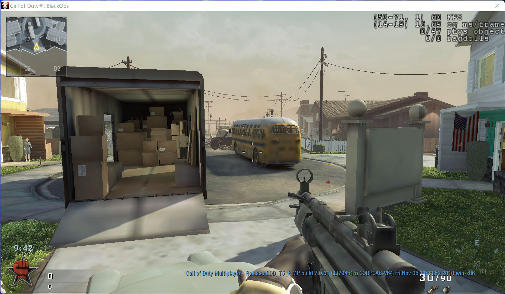
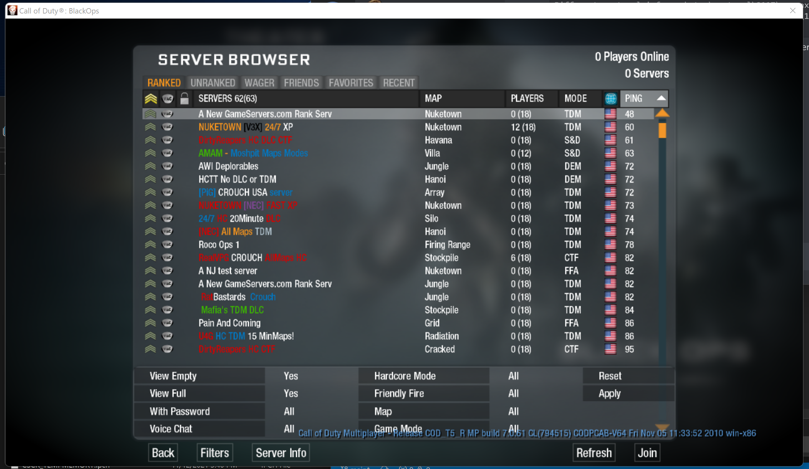
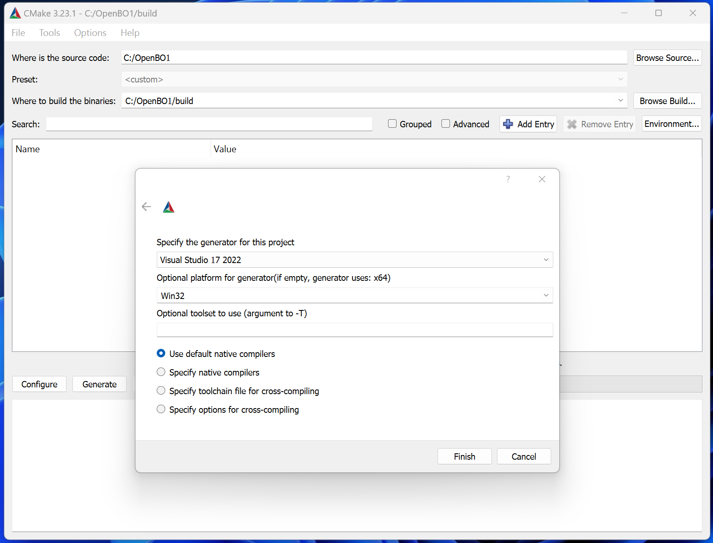

# OpenBO1

*(Recently under new maintenance, things subject to change)*

# Official Releases
Official releases will not be available until the project reaches a playable state. You can follow the development progress on the [public discord](https://discord.gg/EhsacxezBp).

# Build on Windows
[Git for Windows](https://git-scm.com/download/win)  
[Microsoft Visual Studio 2022](https://visualstudio.microsoft.com/fr/vs/)  
[CMake](https://cmake.org/)  

# Documentation
[The documentation](https://openbo1.github.io/OpenBO1/) is generated from the repository source codes directly. It contains all necessary resources including source code snippets, details on execution of the programs, diagrammatic representation of program flow, and links to external resources.

# Credits
Thanks to all the people - many of whom wish to remain nameless - who contributed directly or indirectly in making this project possible.

# Legal
OpenBO1 is licensed under the [GPLv3](LICENSE.md) and is **not affiliated, associated, authorized, endorsed by, or in any way officially connected with Activision Blizzard, Inc**.
